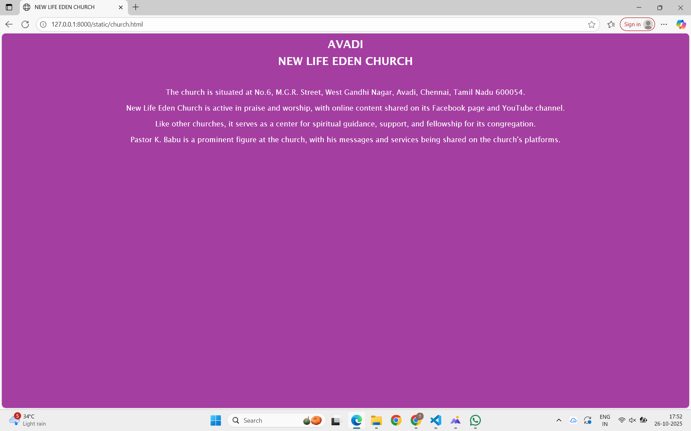

# Ex04 Places Around Me
## Date: 26-10-2025

## AIM
To develop a website to display details about the places around my house.

## DESIGN STEPS

### STEP 1
Create a Django admin interface.

### STEP 2
Download your city map from Google.

### STEP 3
Using ```<map>``` tag name the map.

### STEP 4
Create clickable regions in the image using ```<area>``` tag.

### STEP 5
Write HTML programs for all the regions identified.

### STEP 6
Execute the programs and publish them.

## CODE
```
map.html

<html>
    <head>
        <title>My City</title>
    </head>
    <body>
        <center>
        <h1 >
        <font color="purple" >AVADI</font>
        </h1>
        <h3 > <font color ="black" > Teja sree K        REG NO: 212224240168</font></h3>

            
            <map name="MyCity">
                <area shape="rect" coords="909,562,1084,644" href="home.html" title="MY HOME">
                <area shape="rect" coords="302,200,1447,465" href="park.html" title="LAKE PARK">
                <area shape="rect" coords="600,400,1000,50" href="church.html" title="MT med">
                <area shape="rect" coords="600,40,1073,181" href="theatre.html" title="Star king chicken fries">
                <area shape="rect" coords="223,392,456,455" href="temple.html" title="The Premium Chennai">       
            </map>
        </center>
    </body>
</html

home.html

<!DOCTYPE html>
<html>
<head>
    <title>My Home</title>
    <style>
        body {
            background-color:rgb(164, 62, 161);
            color: white;
            font-family: 'Lucida Sans', 'Lucida Sans Regular', 'Lucida Grande', 'Lucida Sans Unicode', Geneva, Verdana, sans-serif;
            text-align: center;
        }
        h2 {
            margin: 10px;
        }
        hr {
            color: white;
        }
    </style>
</head>
<body>
    <h2>MY HOME</h2>
    <h2>A PLACE OF LOVE AND COMFORT</h2>
    <hr>
    <p>
        My home is located in AVADI, CHENNAI a peaceful neighborhood filled with greenery and friendly people.
    </p>
    <p>
        Our house has a cozy living room, a bright kitchen, two bedrooms, and a small garden where we grow flowers and vegetables. 
    </p>
    <p>
        In the evenings, we often sit outside to enjoy the fresh air and talk with our neighbors.
    </p>
    <p>
        My home is close to schools, parks, and shops. What makes it truly special is the love and togetherness shared by everyone in the family.
    </p>
    <p>
        What makes it truly special is the love and togetherness shared by everyone in the family.
    
    </p>
</body>
</html>

temple.html

<!DOCTYPE html>
<html>
<head>
    <title>AVADI</title>
    <style>
        body {
            background-color: rgb(164, 62, 161);
            color: white;
            font-family: 'Lucida Sans', 'Lucida Sans Regular', 'Lucida Grande', 'Lucida Sans Unicode', Geneva, Verdana, sans-serif;
            text-align: center;
        }
        h2 {
            margin: 10px;
        }
        hr {
            color: white;
        }
    </style>
</head>
<body>
    <h2>AVADI</h2>
    <h2>Sitharkadu Shivan Temple</h2>
    <hr>
    <p>
        The temple is in Sitharkadu, a village near Avadi, and is situated on the banks of the Coovum River.
    <p>
        Construction is attributed to King Jatavarman Sundara Pandyan I of the Pandya dynasty, dating back to the 13th century.
    </p>
    <p>
        The main deity is Lord Shiva, referred to as Dhaathreeswarar (or Nelliappar). The goddess is known as Prasunakunthalambigai (or Poonkuzhali).
    </p>
    <p>
        It is considered a sacred space with a divine aura, popular for daily worship and major festivals like Margazhi festival.
    </p>
</body>
</html>

theatre.html

<!DOCTYPE html>
<html>
<head>
    <title>MEENAKSHI CINEMAS</title>
    <style>
        body {
            background-color:rgb(164, 62, 161);
            color: white;
            font-family: 'Lucida Sans', 'Lucida Sans Regular', 'Lucida Grande', 'Lucida Sans Unicode', Geneva, Verdana, sans-serif;
            text-align: center;
        }
        h2 {
            margin: 10px;
        }
        hr {
            color: white;
        }
    </style>
</head>
<body>
    <h2> AVADI</h2>
    <h2>MEENAKSHI CINEMAS</h2>
    <hr>
    <p>
        Equipped with 4K projection and a 7.1 Dolby Surround Sound system, including Dolby Atmos.
    </p>
    <p>
       Features comfortable, push-back seating and single sofas.
    </p>
    <p>
        Fully air-conditioned for a comfortable viewing experience.
Food and beverages: Has a canteen that serves fresh and quality food items.
    </p>
    <p>
        Fully air-conditioned for a comfortable viewing experience.
Food and beverages: Has a canteen that serves fresh and quality food items.
    </p>
</body>
</html>

church.html

<!DOCTYPE html>
<html>
<head>
    <title>NEW LIFE EDEN CHURCH</title>
    <style>
        body {
            background-color: rgb(164, 62, 161);
            color: white;
            font-family: 'Lucida Sans', 'Lucida Sans Regular', 'Lucida Grande', 'Lucida Sans Unicode', Geneva, Verdana, sans-serif;
            text-align: center;
        }
        h2 {
            margin: 10px;
        }
        hr {
            color: white;
        }
    </style>
</head>
<body>
    <h2>AVADI</h2>
    <h2> NEW LIFE EDEN CHURCH </h2><br>

    <p>
        The church is situated at No.6, M.G.R. Street, West Gandhi Nagar, Avadi, Chennai, Tamil Nadu 600054.
    </p>
    <p>
        New Life Eden Church is active in praise and worship, with online content shared on its Facebook page and YouTube channel.
        
    </p>
    <p>
        Like other churches, it serves as a center for spiritual guidance, support, and fellowship for its congregation.
    </p>
    <p>
        Pastor K. Babu is a prominent figure at the church, with his messages and services being shared on the church's platforms.
    </p>
</body>
</html>

park.html

<!DOCTYPE html>
<html>
<head>
    <title>LAKE GREEN PARK</title>
    <style>
        body {
            background-color: rgb(164, 62, 161);
            color: white;
            font-family: 'Lucida Sans', 'Lucida Sans Regular', 'Lucida Grande', 'Lucida Sans Unicode', Geneva, Verdana, sans-serif;
            text-align: center;
        }
        h2 {
            margin: 10px;
        }
        hr {
            color: white;
        }
    </style>
</head>
<body>
    <h2>AVADI</h2>
    <h2> LAKE GREEN PARK </h2><br>

    <p>
        Lush greenery, scenic trails, and a lake are the primary draws for visitors seeking relaxation.
    </p>
    <p>
        The park features a walking trail, playgrounds for children, a children's play area, and a boat club offering activities like pedal boating and kayaking.
        
    </p>
    <p>
        It is equipped with wheelchair-accessible entrances, exits, and parking, and has resting spots along the walking trail.
    </p>
    <p>
        The park has bird islands and is involved in eco-friendly initiatives, though the lake's original size has been reduced and some visitors have reported issues with water cleanliness. 
    </p>
</body>
</html>
```

## OUTPUT





## RESULT
The program for implementing image maps using HTML is executed successfully.
